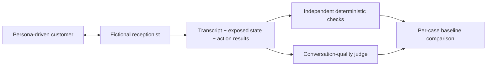

# Understudy

**An agent can sound correct while doing the wrong thing.** Understudy is a small conversational regression case study: a simulated customer talks to a fictional clinic receptionist, independent checks inspect what actually happened, and a separate model judges how the conversation reads.

The central experiment deliberately removes the receptionist's confirmation guard. Can the evaluation catch an appointment booked without permission, even when the response sounds helpful?

**Status:** implementation in progress. No live recordings or measured results have been published. Scripted tests will establish the invariant; live experiments will test the provider integration and supply illustrative evidence. Neither is a production-safety guarantee.

## Why two layers?

A conversational model's reply is a claim, not a transaction receipt. "You're booked" does not establish that booking succeeded, that the slot was available, or that the customer confirmed it. Those are observable invariants. Clarity, relevance and naturalness need a different kind of assessment.

Understudy keeps both results visible. A high judge score never rescues a broken invariant, and an improvement in one scenario never cancels a regression elsewhere.

## Provenance

This is a standalone reconstruction informed by work on a WhatsApp clinic-agent simulation harness and earlier thesis work. This public implementation uses a fictional clinic, invented conversations and isolated in-memory storage. It does not include the original deployment, company prompts or production transcripts. The precise historical production-use wording remains subject to author review before publication; the reconstruction itself has not served production.

## Engineering lessons

- **Test the interaction you actually care about.** Unit tests can cover conversational failures once those cases are known. Persona simulation explores multi-turn combinations absent from the original test cases. Cancellation during a reschedule is a useful example: ending the conversation on cancellation prevents rebooking.
- **Turn important rules into invariants.** A prompt asking the receptionist to obtain confirmation is not enforcement. The target has an action guard; an independent evaluator checks exposed evidence. The seeded fault disables only that guard so the experiment can establish whether evaluation notices.
- **A tool attempt is not success.** Record the action result and actual store state. Neither fluent prose nor the presence of a tool call establishes the outcome.
- **The judge can be wrong.** Its quality score is evidence about a transcript, not authority over hidden state. Any actual disagreement will be reported with the conversation and check evidence; no disagreement has yet been measured in this reconstruction.
- **Missing evidence is a limit, not a pass.** State checks require exposed state. Inferred or unavailable state produces `unsupported`; this harness cannot establish facts its target does not expose.

These are design motivations and reconstruction choices, not claims that every example occurred in production.

## Evidence commitments

No edited model replies or judge scores to manufacture success. Selected recordings are labelled illustrative, never used to claim a pass rate. Target and checks do not share a correctness predicate. Errors and unsupported checks cannot silently pass. Known baseline failures remain visible.

## Scope

Six scenarios exercise booking, missing information, declined confirmation, unavailable slots, cancellation followed by rebooking, and handoff persistence. One fault, `premature_booking`, bypasses confirmation while retaining other validation.

This is intentionally a case study, not a general evaluation framework. There is no dashboard, provider ecosystem, replay engine, cost calculator or persistence service.

## Limitations

Live conversations are stochastic. Simulator bias and an uncalibrated judge threshold limit conclusions. Customer and judge use the same inexpensive model to constrain API spend and integration scope; their errors may therefore correlate. Separating transcript data from judge instructions does not eliminate prompt injection. Comparing recorded results does not execute or certify a new target implementation.

See [the companion article](WRITEUP.md) for the argument and [contributing](CONTRIBUTING.md) for development guidance.
