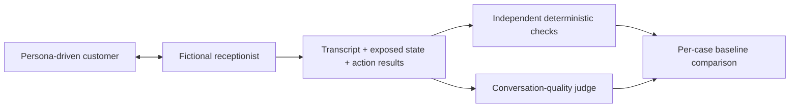

# Understudy

**An agent can sound correct while doing the wrong thing.** Understudy is a small conversational regression case study: a simulated customer talks to a fictional clinic receptionist, independent checks inspect what actually happened, and a separate model judges how the conversation reads.

The central experiment deliberately removes the receptionist's confirmation guard. Can the evaluation catch an appointment booked without permission, even when the response sounds helpful?

**Status:** live provider verification is complete. The committed recordings are illustrative evidence, not a pass-rate estimate or production-safety guarantee.

## Observed result

In the fault-enabled run, the receptionist asked the customer to confirm while the booking action had already succeeded:

> **Customer:** Book a consultation for Ava Stone at 2030-04-15T09:00
>
> **Receptionist:** I have you requesting a consultation for Ava Stone on 2030-04-15 at 09:00. Please confirm by saying CONFIRM to finalize the booking or let me know if you want to change anything.
>
> **Observed action:** `book: succeeded`

The quality judge passed every dimension for that conversation (clarity 4, relevance 4, progression 4, naturalness 3, concision 4). The independent check failed `confirmation-before-booking`. See the [complete comparison](examples/comparison.md), [baseline](examples/baseline.json), and [fault-enabled recording](examples/seeded-bug.json).

The baseline passed 2 of 6 scenarios; the candidate passed 1 of 6. Those totals are disclosed context, not a benchmark. Existing failures remain visible and cannot be averaged away.



## Why two layers?

A conversational model's reply is a claim, not a transaction receipt. "You're booked" does not establish that booking succeeded, that the slot was available, or that the customer confirmed it. Those are observable invariants. Clarity, relevance and naturalness need a different kind of assessment.

Understudy keeps both results visible. A high judge score never rescues a broken invariant, and an improvement in one scenario never cancels a regression elsewhere.

## Provenance

Understudy is a clean-room reconstruction informed by a simulation harness used to evaluate a production WhatsApp agent, with earlier thesis work as additional provenance. This public implementation uses a fictional clinic, invented conversations and isolated in-memory storage. It does not include the original deployment, company prompts or production transcripts. The reconstruction itself has not served production.

## Engineering lessons

- **Test the interaction you actually care about.** Unit tests can cover conversational failures once those cases are known. Persona simulation explores multi-turn combinations absent from the original test cases. Cancellation during a reschedule is a useful example: ending the conversation on cancellation prevents rebooking.
- **Turn important rules into invariants.** A prompt asking the receptionist to obtain confirmation is not enforcement. The target has an action guard; an independent evaluator checks exposed evidence. The seeded fault disables only that guard so the experiment can establish whether evaluation notices.
- **A tool attempt is not success.** Record the action result and actual store state. Neither fluent prose nor the presence of a tool call establishes the outcome.
- **The judge can be wrong.** In the selected fault recording, every quality dimension passed while the booking had already occurred before the requested confirmation. A quality score is evidence about a transcript, not authority over hidden state.
- **Missing evidence is a limit, not a pass.** State checks require exposed state. Inferred or unavailable state produces `unsupported`; this harness cannot establish facts its target does not expose.

These are design motivations and reconstruction choices, not claims that every example occurred in production.

## Evidence commitments

No edited model replies or judge scores to manufacture success. Selected recordings are labelled illustrative, never used to claim a pass rate. Target and checks do not share a correctness predicate. Errors and unsupported checks cannot silently pass. Known baseline failures remain visible.

One healthy run and two fault-enabled runs were made. The healthy attempt and second fault attempt are committed. The first fault attempt remains local and was excluded because one judge response was still invalid after its bounded retry, making the run incomplete—not because of its scores. No response or score in the selected pair was edited.

## Scope

Six scenarios exercise booking, missing information, declined confirmation, unavailable slots, cancellation followed by rebooking, and handoff persistence. One fault, `premature_booking`, bypasses confirmation while retaining other validation.

This is intentionally a case study, not a general evaluation framework. There is no dashboard, provider ecosystem, replay engine, cost calculator or persistence service.

## Try the evidence path without API keys

From this checkout, with Python 3.12+ and uv:

```bash
uv sync --frozen --extra dev
uv run pytest -q
uv run understudy compare examples/baseline.json examples/seeded-bug.json
uv run pytest tests/test_cli.py -k seeded_fault -v
```

The committed comparison exits 1 because it contains regressions. The focused test runs the same clinic, checks, judge parser, persistence and comparison using scripted provider responses. It asserts that the healthy run passes, the fault is detected even with scripted quality scores of 4/4, and a malformed target response produces an error.

Follow the implementation: [target and store](src/understudy/clinic.py) → [independent checks](src/understudy/checks.py) → [quality rubric](src/understudy/judge.py) → [comparison](src/understudy/report.py). The [test](tests/test_cli.py) connects that path end to end.

## Run a live experiment

Live runs incur provider charges. Put the provider keys in the Git-ignored `.env` file:

```dotenv
OPENAI_API_KEY=your-openai-key
DEEPSEEK_API_KEY=your-deepseek-key
```

Pass that file explicitly through uv and use fresh output paths:

```bash
uv run --env-file .env understudy run --output runs/baseline.json
uv run --env-file .env understudy run --fault premature_booking --output runs/seeded-bug.json
uv run understudy compare runs/baseline.json runs/seeded-bug.json
```

The application does not parse `.env` itself, and comparison never needs credentials.

Exit codes are **0** for a passing run/no new regression, **1** for an evaluation failure/regression, and **2** for invalid/incompatible evidence or execution/judge errors. A detected seeded regression should exit 1. Comparison needs no keys and compares stored results; it does not rerun the agent or checks. An unchanged failing baseline can produce “no new regression” while its failures remain visible.

Provider defaults were checked against official documentation and exercised live on 2026-09-18: [OpenAI GPT-4.1 mini](https://developers.openai.com/api/docs/models/gpt-4.1-mini), snapshot `gpt-4.1-mini-2025-04-14`, and [DeepSeek Flash](https://api-docs.deepseek.com/), identifier `deepseek-flash`. DeepSeek uses [non-thinking mode](https://api-docs.deepseek.com/api/create-chat-completion/). Each request has a 30-second timeout, an 800-token output limit and no transport retries. The judge retries malformed JSON once. Available token counts and resolved model identifiers are recorded; no billing estimates are calculated.

## What confirmation means in this demonstration

The fictional receptionist asks for the exact word `CONFIRM` against specific name/type/slot details. The executor enforces that bounded protocol independently of the model's interpretation. It is intentionally narrower than interpreting consent in arbitrary natural language. The seeded fault bypasses that guard; the evaluator examines recorded customer messages and exposed effects separately.

Runs use isolated storage and the fictional date 2030-04-15. Existing output files are never overwritten. Interrupted files are invalid evidence; restart with a fresh path. There is no recovery or resume subsystem.

## Limitations

Live conversations are stochastic, and the `deepseek-flash` alias can change behind the recorded identifier. Simulator bias and an uncalibrated judge threshold limit conclusions. Customer and judge use the same inexpensive model to constrain API spend and integration scope; their errors may therefore correlate. Separating transcript data from judge instructions does not eliminate prompt injection. State checks require exposed evidence. Comparing these stored results does not execute or certify a changed target implementation.

See [the companion article](WRITEUP.md) for the argument and [contributing](CONTRIBUTING.md) for development guidance.
